## Relatório de Testes Exploratórios

9 de julho de 2026

Ana Beatriz Pimentel Soares

## 1. Objetivo
Realizar testes exploratórios na página de cadastro disponibilizada para o desafio técnico, com o objetivo de identificar possíveis defeitos funcionais, problemas de usabilidade, inconsistências de interface e oportunidades de melhoria.
A abordagem exploratória foi escolhida por permitir uma investigação dinâmica da aplicação, simulando o comportamento de um usuário durante o preenchimento do formulário de cadastro.

---

## 2. Aplicação Avaliada
URL
http://demo.automationtesting.in/Register.html

---

## 3. Ambiente de Testes

Sistema Operacional	   Windows 11

---

## 4. Estratégia Utilizada
Os testes foram conduzidos utilizando abordagem exploratória baseada em experiência (Experience-Based Testing), buscando validar:

- Campos obrigatórios;
- Validação de dados;
- Restrições de entrada;
- Navegação entre campos;
- Comportamento dos componentes da interface;
- Consistência visual;
- Mensagens de erro;
- Fluxo de cadastro.

Foram aplicadas técnicas como:

- Boundary Value Analysis (quando aplicável);
- Entrada de dados inválidos;
- Entrada de dados extremos;
- Tentativas de envio incompleto;
- Navegação não convencional;
- Testes de usabilidade.

---

## 5. Funcionalidades Exploradas
- Funcionalidades
- Nome
- Sobrenome
- Endereço
- E-mail
- Telefone
- Gênero
- Hobbies
- Idiomas
- Skills
- País
- Data de nascimento
- Senha
- Confirmar senha
- Upload de imagem
- Submit

---

## 6. Cenários Explorados
Durante a execução foram avaliados cenários como:
•	Cadastro completamente válido;
•	Campos obrigatórios em branco;
•	E-mail inválido;
•	Telefone contendo caracteres especiais;
•	Telefone contendo letras;
•	Senhas diferentes;
•	Senhas vazias;
•	Upload de arquivo;
•	Seleção de múltiplos idiomas;
•	Alteração de país;
•	Datas de nascimento diferentes;
•	Navegação utilizando teclado;
•	Combinação de múltiplos hobbies.

---

## 7. Defeitos Encontrados

## BUG-001
Título
Campo First Name e Last Name aceitam entradas inválidas.
Passos para reproduzir
1.	Abrir a página de cadastro.
2.	Informar nos campos First Name e Last Name:
o	uma sequência com mais de 100 caracteres;
o	apenas um número;
o	apenas símbolos;
o	apenas espaços.
3.	Continuar o preenchimento do formulário.
Resultado esperado
Os campos deveriam aceitar apenas caracteres alfabéticos, limitar o tamanho máximo permitido e rejeitar entradas compostas apenas por números, símbolos ou espaços.
Resultado obtido
Os campos aceitam todas as entradas informadas sem validação.
Severidade
Média
Prioridade
Alta
Evidência

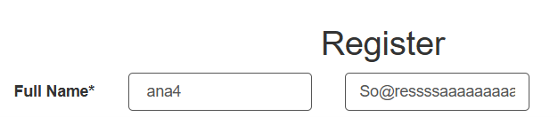

---

## BUG-002
Título
Campo Address aceita valores inválidos sem validação.
Passos para reproduzir
1.	Informar um endereço extremamente longo.
2.	Informar apenas uma letra.
3.	Informar apenas um número.
4.	Informar apenas um símbolo.
Resultado esperado
O sistema deveria validar um tamanho mínimo e máximo e impedir entradas incompatíveis com um endereço.
Resultado obtido
O campo aceita qualquer conteúdo informado.
Severidade
Baixa
Prioridade
Média
Evidência

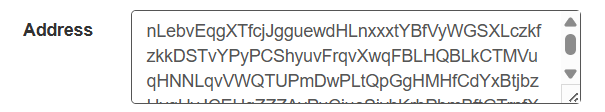

---

## BUG-003
Título
Campo E-mail aceita domínio inválido.
Passos para reproduzir
1.	Informar um e-mail com domínio inexistente.
2.	Prosseguir com o preenchimento.
Resultado esperado
O sistema deveria validar o formato completo do endereço de e-mail.
Resultado obtido
O e-mail é aceito mesmo contendo domínio inválido.
Severidade
Alta
Prioridade
Alta
Evidência

---

## BUG-004
Título
Campo Phone não informa o formato esperado.
Passos para reproduzir
1.	Informar diferentes formatos de telefone.
2.	Observar o comportamento do campo.
Resultado esperado
O sistema deveria informar claramente o formato esperado ou aplicar máscara de preenchimento.
Resultado obtido
Não existe indicação do formato esperado para o telefone.
Severidade
Baixa
Prioridade
Média
Evidência

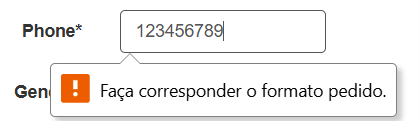

---

## BUG-005
Título
Idioma selecionado desaparece da lista de seleção.
Passos para reproduzir
1.	Selecionar um idioma.
2.	Abrir novamente a lista de idiomas.
Resultado esperado
O idioma selecionado deveria permanecer visível e identificado como selecionado.
Resultado obtido
O idioma deixa de aparecer na lista.
Severidade
Baixa
Prioridade
Baixa
Evidência

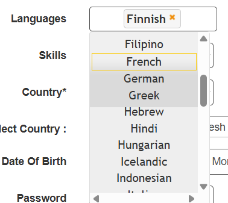

---

## BUG-006
Título
Campo Skills permite selecionar apenas uma habilidade.
Passos para reproduzir
1.	Selecionar uma habilidade.
2.	Tentar selecionar outra.
Resultado esperado
Caso o requisito permita múltiplas habilidades, o sistema deveria possibilitar múltiplas seleções.
Resultado obtido
É possível selecionar apenas uma habilidade.
Severidade
Baixa
Prioridade
Baixa
Observação
Necessita validação do requisito funcional.
Evidência

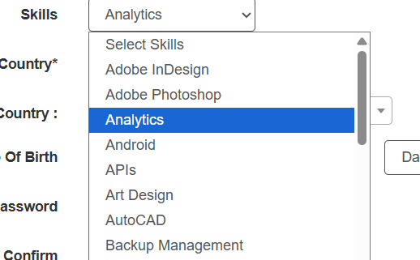
 
 ---

## BUG-007
Título
Campo Country impede a conclusão do cadastro.
Passos para reproduzir
1.	Preencher todos os campos do formulário.
2.	Tentar selecionar um país.
3.	Submeter o formulário.
Resultado esperado
O usuário deveria conseguir selecionar um país e concluir o cadastro.
Resultado obtido
O campo não permite seleção adequada, impossibilitando a submissão do formulário.
Severidade
Crítica
Prioridade
Crítica
Evidência

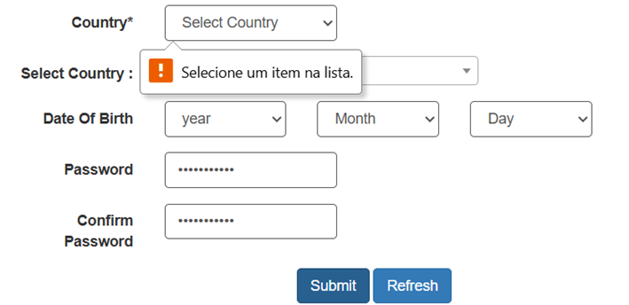
 
 ---

## BUG-008
Título
Campo Year aceita anos antigos.
Passos para reproduzir
1.	Selecionar o ano 1916.
Resultado esperado
O sistema deveria limitar datas de nascimento conforme as regras de negócio.
Resultado obtido
É possível selecionar anos antigos.
Severidade
Baixa
Prioridade
Baixa
Observação
Depende da regra de negócio.
Evidência

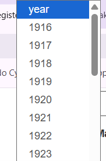

---

## BUG-009
Título
É possível selecionar datas inexistentes.
Passos para reproduzir
1.	Selecionar:
o	Dia: 31
o	Mês: Fevereiro
2.	Continuar o cadastro.
Resultado esperado
Datas inválidas não deveriam ser permitidas.
Resultado obtido
O sistema aceita uma data inexistente.
Severidade
Alta
Prioridade
Alta
Evidência

---

## BUG-010
Título
O formulário não apresenta mensagens claras para campos obrigatórios.
Passos para reproduzir
1.	Abrir a página.
2.	Clicar em Submit sem preencher os campos.
Resultado esperado
O sistema deveria informar claramente todos os campos obrigatórios não preenchidos.
Resultado obtido
As mensagens apresentadas são insuficientes e dependem da validação padrão do navegador.
Severidade
Média
Prioridade
Alta
Evidência

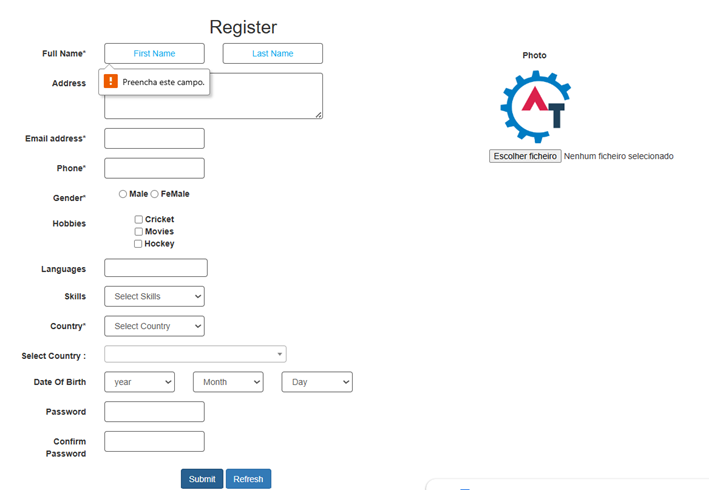

---

## BUG-011
Título
Campos Password e Confirm Password não são tratados como obrigatórios.
Passos para reproduzir
1.	Preencher os demais campos.
2.	Deixar os campos de senha vazios.
3.	Prosseguir com o cadastro.
Resultado esperado
Os campos deveriam ser obrigatórios.
Resultado obtido
Não há indicação clara de obrigatoriedade.
Severidade
Alta
Prioridade
Alta
Evidência

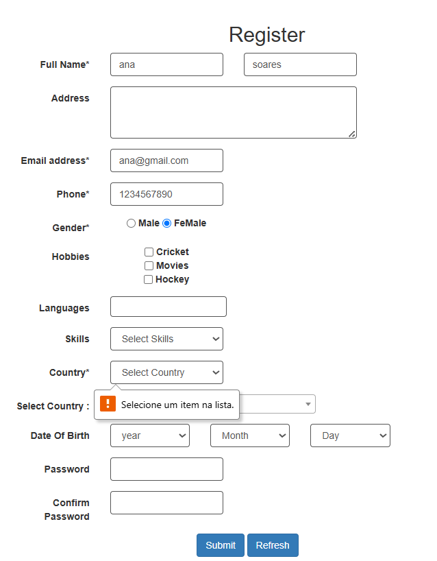

---

## BUG-012
Título
Sistema aceita senhas diferentes entre Password e Confirm Password.
Passos para reproduzir
1.	Informar senhas diferentes.
2.	Submeter o formulário.
Resultado esperado
O sistema deveria impedir o cadastro e informar que as senhas não coincidem.
Resultado obtido
O formulário aceita senhas diferentes.
Severidade
Crítica
Prioridade
Crítica
Evidência

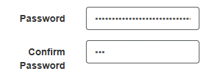

---

## BUG-013
Título
Campo de senha aceita senha composta por apenas um caractere.
Passos para reproduzir
1.	Informar uma senha contendo apenas um caractere.
2.	Confirmar a mesma senha.
Resultado esperado
A senha deveria respeitar uma política mínima de segurança.
Resultado obtido
O sistema aceita senha composta por apenas um caractere.
Severidade
Alta
Prioridade
Alta
Evidência

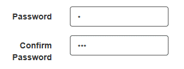
 
 ---

## BUG-014
Título
Campo de upload aceita formatos de arquivo não esperados.
Passos para reproduzir
1.	Selecionar arquivos nos formatos:
o	PDF
o	DOCX
o	PPTX
o	TXT
Resultado esperado
O sistema deveria aceitar apenas formatos de imagem compatíveis.
Resultado obtido
Arquivos que não são imagens são aceitos.
Severidade
Alta
Prioridade
Alta
Evidência

---

## BUG-015
Título
Imagem selecionada não é exibida ao usuário.
Passos para reproduzir
1.	Selecionar uma imagem válida.
2.	Observar o campo de upload.
Resultado esperado
O sistema deveria apresentar uma pré-visualização ou alguma confirmação visual do arquivo selecionado.
Resultado obtido
A imagem não é exibida após a seleção.
Severidade
Baixa
Prioridade
Baixa
Evidência

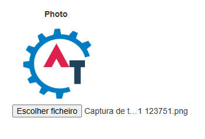
 
 ---

## 8. Considerações
Durante a execução dos testes também foram identificadas oportunidades de melhoria que não caracterizam necessariamente defeitos funcionais:
•	Implementar opção para visualizar/ocultar as senhas digitadas.
•	Impedir a seleção dos valores padrão "Year", "Month" e "Day" durante a submissão do formulário.
•	Reduzir a quantidade de anúncios presentes na página, melhorando a experiência do usuário.
•	Exibir instruções de preenchimento (máscaras, placeholders e exemplos) em campos como telefone e endereço.

---

## 9. Conclusão
Os testes exploratórios permitiram identificar diversos pontos de melhoria e defeitos que afetam tanto a experiência do usuário quanto a integridade dos dados inseridos no sistema.
Foram encontradas falhas classificadas como críticas, altas, médias e baixas, evidenciando a necessidade de revisão das regras de validação do formulário, dos controles de entrada de dados e do fluxo de cadastro. A correção desses problemas contribuirá para aumentar a confiabilidade da aplicação, reduzir inconsistências cadastrais e proporcionar uma experiência mais segura e intuitiva aos usuários.
Os resultados obtidos serviram como base para a elaboração dos casos de teste funcionais e para a definição dos cenários priorizados na automação de testes.

